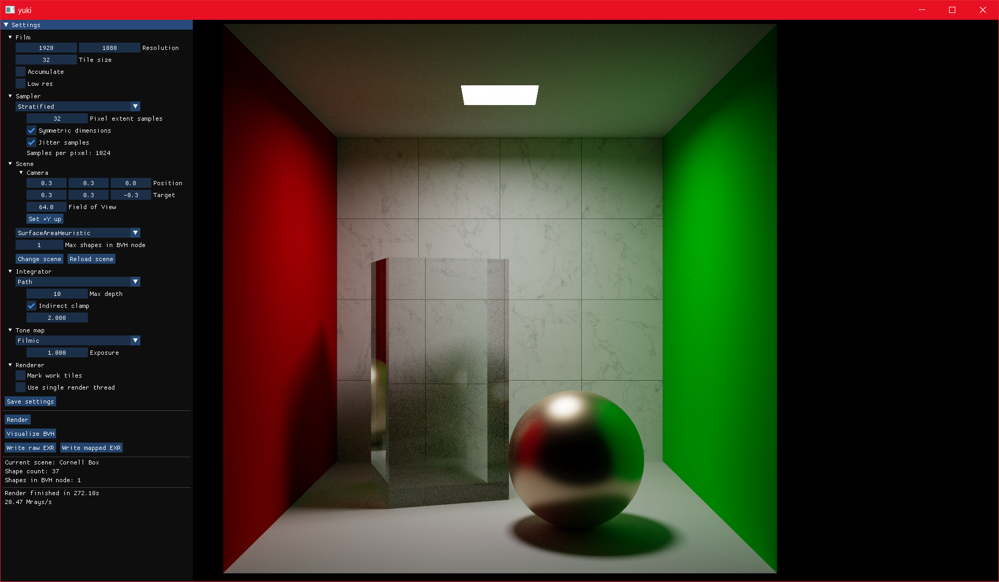

# yuki



Ray cast renderer mostly based on [Physically Based Rendering 3rd edition](http://www.pbr-book.org/) ([pbrt-v3](https://github.com/mmp/pbrt-v3)).

## Running

The project can be run most easily with

```
cd yuki && cargo run --release
```

## Goals
- Explore offline rendering techniques
- Try out how Rust helps/complicates a moderately complex system
  - Including vectorization, at some point, hopefully...
- Prioritize interactivity
  - Shorter iteration times for scene, parameter tweaks mean more exploration and validation


## Features

### UI
- Settings from yaml
  - Ui button that generates a full dump of current settings
- Uniformly scaling film view
- Tone mapping
  - Filmic ACES tonemap (Stephen Hill's fit) with exposure
  - Heatmap
    - Single channel or luminance
    - Dynamic fitting of min,max
- ~Non-blocking rendering
  - Relevant ui changes cause a new render task
- EXR export for the raw values or tone mapped output
  - [HDRView](https://github.com/wkjarosz/hdrview) is snappy for inspection and diffs
- Basic mouse control for camera
  - Trackball, planar track, dolly
  - Adapted from [Max Liani](https://maxliani.wordpress.com/2021/06/08/offline-to-realtime-camera-manipulation/)
- Rasterized debug rays
- Headless rendering to .exr

### Renderer
- Tile-based rendering
  - Unwinding spiral pattern
    - Camera controls usable with longer frame times than if rendered row-by-row
  - Active work tiles can be marked
    - Not separately cleared when film clear is disabled to minimize lag
- BVH
  - Splits
    - Surface area heuristic
    - Middle
    - Equal counts
- Integrator abstraction
  - Whitted
    - Direct diffuse lighting
    - Shadows
    - Mirror specular reflections and transmission
  - Path
    - Russian roulette based on contribution after 3 bounces
  - Normals debug
  - BVH intersections debug
- Samplers
  - Uniform
  - Stratified
- Light types
  - Point
  - Spot
  - Rectangular
- Material types (pbrt's Material/BSDF/BxDF abstraction)
  - Matte
    - Lambertian for rough, Oren-Nayar otherwise
  - Glass
    - Perfect only
  - Metal
    - Torrance-Sparrow with Trowbridge-Reitz/GGX distribution and Fresnel equations for conductors
  - Glossy
    - Torrance-Sparrow with Trowbridge-Reitz/GGX distribution and Schlick's Fresnel approximation
    - Approximates Blender's Glossy BSDF
- Geometric and shading normals

### Scene formats (partially) supported
  - [PLY](http://paulbourke.net/dataformats/ply/)
  - [Mitsuba 2.0](https://mitsuba2.readthedocs.io/en/latest/)
  - [pbrt-v3](https://www.pbrt.org/fileformat-v3)
    - A simple Blender exporter is also included
    - `glossy` material type
      - Takes in `spectrum/rgb Rs` and `float roughness`, which match Blender's Glossy BSDF parameters

## yuki_derive

The math module is an excercise in new stuff, most notably proc_macros inspired by [derive_more](https://github.com/JelteF/derive_more). The implementation itself is quite specific to how the types are structured and supports non-conventional stuff like "deriving" math ops with scalar values or other "vectors" of matching dimensions.

The macro spaghetti is a overkill and likely more code than implementing the same stuff directly, especially if done through standard macros. But hey, it's cool I don't have to list component names for the impl macro :P

## License
While the main repo is licensed under MIT, parts of it are derived from projects licensed under different, compatible terms. See LICENSES for details.
